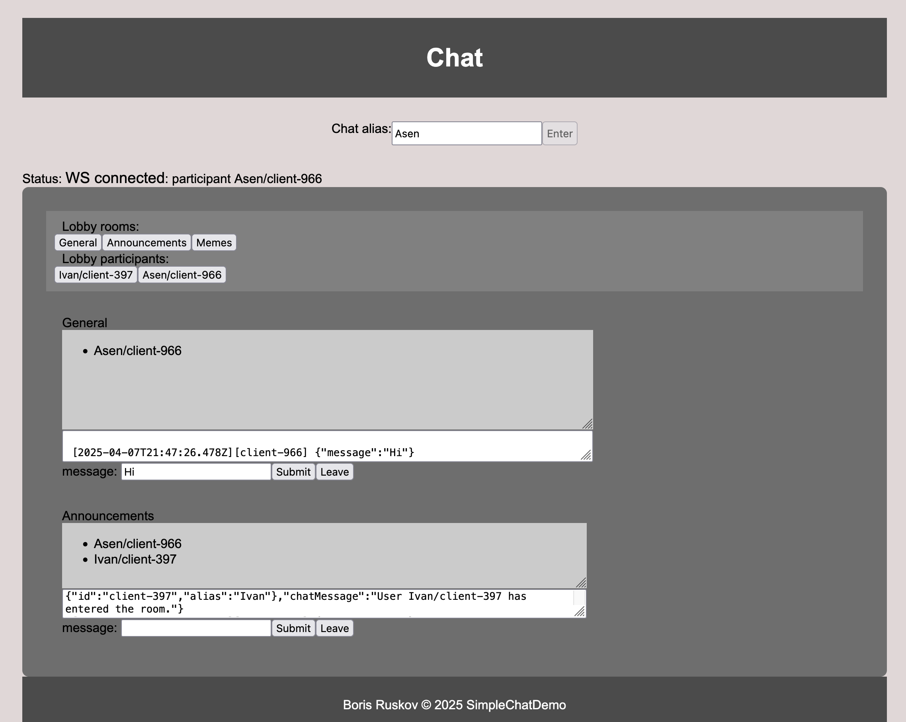

# Simple Chat project

### The following project consists of 2 apps:

- the actual WS chat server, node@v22.14
- static HTML front page for interacting with the chat server API, static-http used for the purpose

### Scripts

### Build and Serve

```json
"start": "npx tsc && node esbuild.config.js && node ./dist/main.js",
```

#### Build only

```json
"build": "npx tsc && node esbuild.config.js",
```

#### Serve with auto-reload (mainly for dev purposes)

```json
"debug": "nodemon src/main.ts",
```

#### Serve with auto-reload (mainly for dev purposes, reviewing built ver)

```json
"debugDist": "nodemon dist/main.js",
```

#### Run for the static server hosting the 2nd app.

```json
"static": "npx http-server --port 8080 --cache-1 -o ./"
```

---

## Endpoints and services

The default PORT for the WS chat server is `3030` . The server does support configurable port throguh its first argument e.g. `node ./dist/main.js 3333` will run it on port `3333` . PS. didn't have the time and don't think its much usable adding dotEnv/.env files for single env variable.

> NB! Given that the second project(static front page) runs and expects to find the chat server at the default port `3030`, using diffrent configuration for the ws server would require changing the hardcoded URL:PORT within the 2nd project, change spot can be found at
> `./public/chatAPI.js` scroll to the bottom you will find

```js
var WS_SERVER_URL = "ws://localhost:3030";
```

> Change it accordingly.

#### Endpoints for the ws server

Endpoints used within the WS

```jsx
WS://localhost:{3030}
WS://localhost:{3030}?alias={name}
```

## Static front page

Static front page is simple application to reuse the functionalities within the webserver. The interface is self-explanatory. Enter the chat via selecting an alias/nickname a server should respond with registring you to the lobby. Where several premade rooms have been created clicking on them will subscribe/join them, for direct communication to diffrent people connected to the server press their names within the Lobby participants section.

> !NB Known issue is that if you delete/edit the textarea where messages are published it will stop be updating(the UI), resizing is fine.

---


